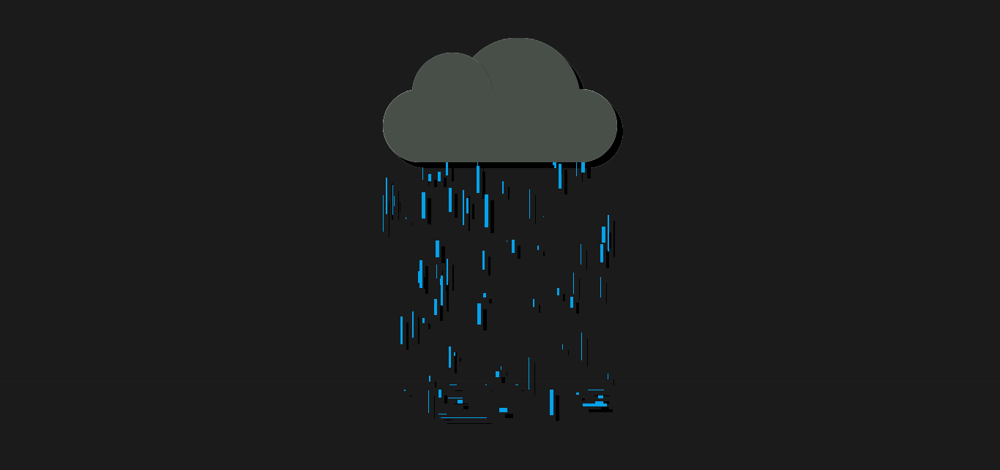

## ANIMATION : TOMBEE DE LA PLUIE

## Le challenge

Construction d'une animation permettant de faire tomber la pluie en HTML5, CSS3 et JavaScript.

## Démonstration

Lien vers le projet : https://aperbet56.github.io/animation_tombee_de_la_pluie/

## Projet développé avec

- Utilisation des balises sémantiques HTML5
- CSS
- Flexbox
- Page web responsive
- Animations CSS
- Utilisation d'un normaliseur : normalize.css
- JavaScript
- Code JavaScript commenté
- Desktop first
